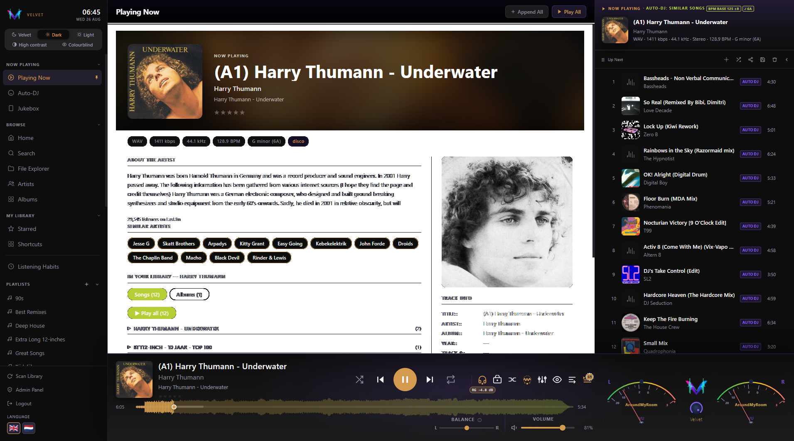
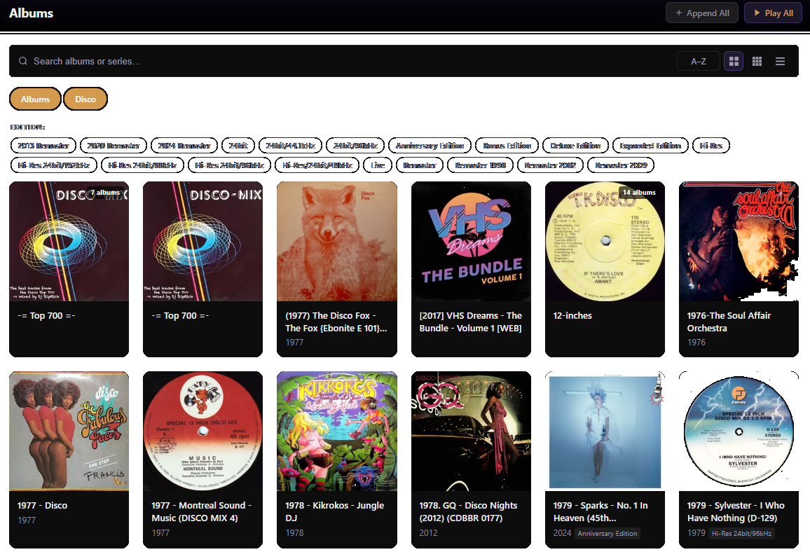
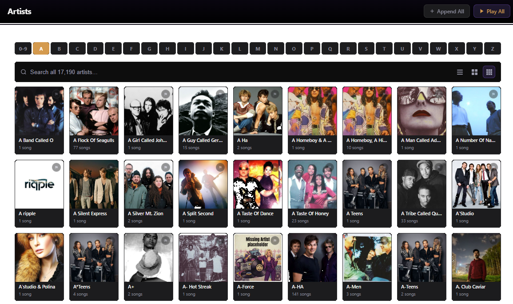
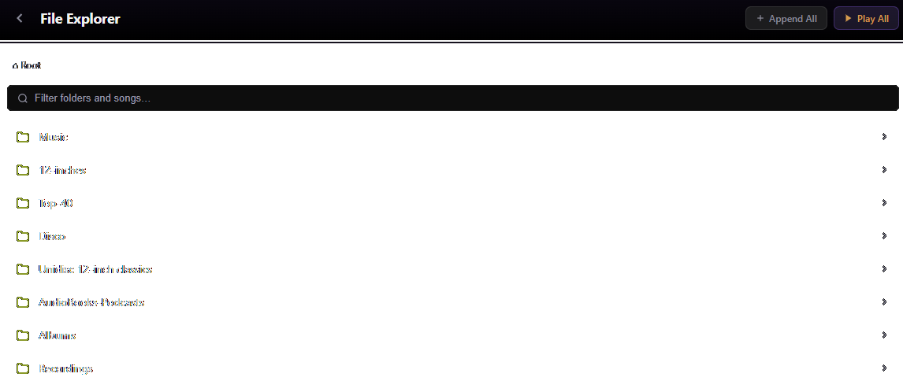
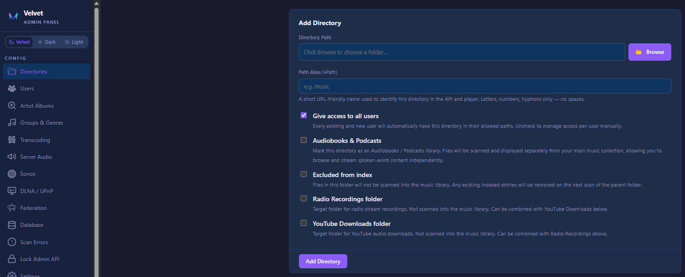
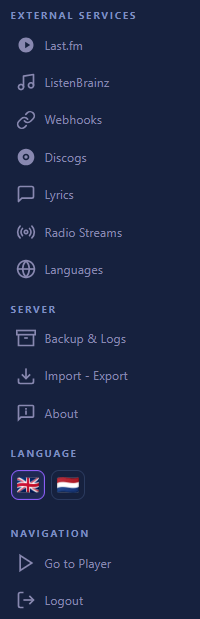
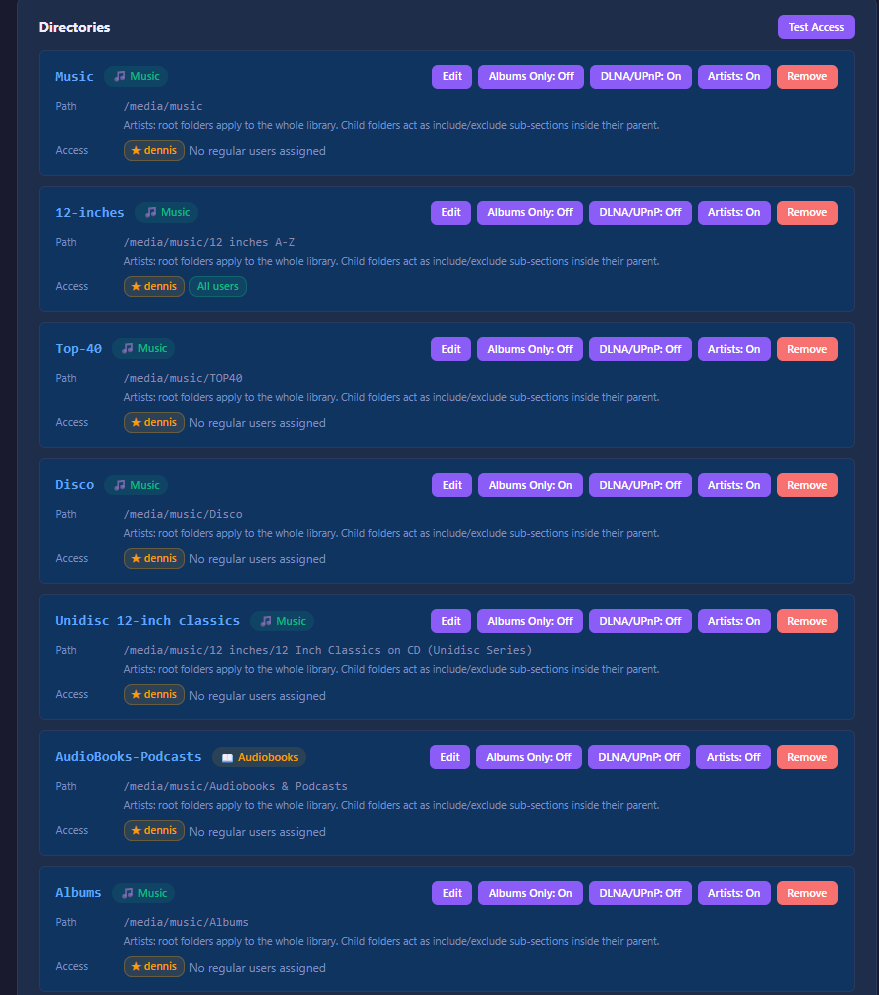
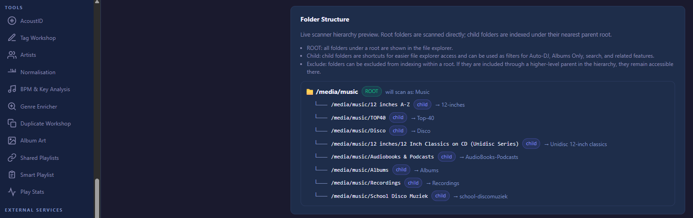

# Velvet

**A self-hosted music server built for people who care about their library.**

Velvet streams your local music collection to any browser, phone, **Samsung Smart TV**, or Subsonic-compatible app — with intelligent Auto-DJ, metadata enrichment, album-art management, and a Milkdrop visualizer. No cloud. No subscription. Your music, your server.

> **Before you continue:** This project was built with AI assistance. If that bothers you, the exit is right there. If you're still reading — welcome, you're going to be fine. Probably. [Read the full disclaimer →](docs/responsible-disclosure.md)

---

## Look and feel

**Now playing** — queue panel, waveform scrubber, album art, and full transport controls in one view:

 

<table>
<tr>
<td width="50%">

**Album browser** — structured library with multi-disc detection, series grouping, and category filters:

</td>
<td width="50%">

**Artist browser** — photo grid with A–Z navigation, song counts, and Discogs-sourced images:

</td>
</tr>
</table>

**File Explorer** — browse your library by folder, filter inline, and queue or play any directory:

 

<table>
<tr>
<td width="68%">

**Admin — Add directory** — vpath wizard with type selection: music, audiobooks, radio recordings, YouTube downloads:

</td>
<td width="32%">

**External services** — Last.fm, ListenBrainz, Discogs, Webhooks, Radio, Lyrics, and language picker:

</td>
</tr>
</table>

<table>
<tr>
<td width="53%">

**Admin — Directories** — manage virtual paths, per-user access, DLNA flags, and folder type per mount:

</td>
<td width="47%">

**Admin — Tools & folder structure** — AcoustID, Tag Workshop, Genre Enricher, BPM analysis, and live hierarchy preview:

</td>
</tr>
</table>

---

## What makes Velvet different

| | |
|---|---|
| **Auto-DJ that thinks** | Similar artists (Last.fm), BPM continuity, harmonic mixing — all three at once, with genre drift prevention so you don't get locked into a single genre cluster |
| **Metadata that works** | Genre Enricher, Album-Art Workshop, AcoustID fingerprinting, and Tag Workshop pull from Last.fm, MusicBrainz, and Discogs — always with a human in the loop |
| **Album library first** | Multi-disc detection, series grouping, category folders, per-disc cover art, CUE sheet support — your classical and box-set collections look right |
| **Listening analytics** | Full play history, skip rates, hourly heat charts, personality type, fun facts — all local, no external calls |
| **Real audio quality** | EBU R128 loudness normalization, gapless playback, crossfade, BPM/harmonic mixing, on-demand transcoding |
| **Plays everywhere** | Browser, **Samsung Smart TV (Tizen app)**, Sonos, DLNA/UPnP, Subsonic API (Symfonium, DSub, Ultrasonic), shared playlist links |

---

## Features

### Player & Playback

- Gapless playback and crossfade (0–5 s, configurable)
- ReplayGain / EBU R128 loudness normalization — track and album mode, true-peak prevention
- Waveform scrubber with chapter markers and buffered-range indicator
- 8-band EQ, audio output device selection (Chrome/Edge)
- Playback speed control for audiobooks (0.75× – 2×)
- Queue with drag-to-reorder, multi-select, and bulk actions
- Queue persistence across page loads and devices (localStorage + server backup)
- Keyboard shortcuts for all transport actions — [full list →](docs/keyboard-shortcuts.md)
- Command palette (Ctrl/K) — fuzzy launch any view or action without lifting your hands
- Milkdrop visualizer (sound-reactive, full-screen) — [credits →](#credits)

### Auto-DJ

Three independent filters that work together and fall back gracefully:

1. **Similar Artists** — Last.fm API, musically related artists to what's playing now
2. **BPM Continuity** — ±N BPM tolerance (configurable), with octave equivalence (72 BPM ≈ 145 BPM)
3. **Harmonic Mixing** — Camelot wheel, six compatible keys per track

Additional controls: keyword filter, genre whitelist/blacklist, minimum star rating, artist cooldown, library scope. Genre drift prevention kicks in when one genre dominates three consecutive tracks or 40% of the last 25 — an escape pick is queued automatically.

BPM and key session anchors lock to the first filtered pick and persist across page refresh. [Full docs →](docs/bpm-harmonic.md)

### Library & Scanning

- Virtual paths (vpaths) — map any folder, set type (`music`, `audio-books`, `recordings`, `youtube`), and control per-user access
- Automatic scan on boot, periodic (default 24 h), or manual — runs in a worker thread, never blocks the server
- CUE sheet support: embedded (FLAC), sidecar `.cue`, or sole `.cue` per folder — each track plays individually with chapter navigation
- Stale-file cleanup, orphaned vpath detection and safe removal
- Genre canonicalization (underscore/space normalization, acronym mapping: `rnb` → `R&B`)
- Scan error audit log with configurable retention

### Album Library

- DB-driven album browser — not a filesystem listing, a structured library
- Multi-disc detection: `CD1/CD2`, `Disc 1/Disc 2`, digit-suffix variants
- Series grouping for box sets and sub-folder collections
- Category folders: `[Live]`, `[Compilations]`, `[Singles]`, `[Remixes]`, plus custom — filtered with one click
- Album version badges from ID3 `TIT3`, `TXXX:EDITION`, or folder name heuristics
- Per-disc cover art — each disc tab shows its own cover when available
- Cover art resolution: folder image → disc image → embedded → placeholder
- BM25 search with column weighting (title × 10 > artist × 5 > album × 3 > filepath × 1)

[Full album docs →](docs/albums.md)

### Artist Library

- Canonical artist name normalization — collapses variants, strips remix credits, handles "feat." prefixes
- Per-artist album grid with series grouping
- Artist images sourced from Discogs with live hydration queue
- Admin image audit: missing, no-image-found, with-image (validation), wrong — with Discogs candidate picker and custom URL apply

### Smart Playlists

Dynamic filter-based playlists that re-evaluate every time you open them:

- Filter by genre (multi-select with group toggle), library/vpath, year range, star rating, play status, starred flag, artist substring
- Sort by artist, album, year, rating, play count, last played, or random
- Fresh Picks: random selection on every open

[Full docs →](docs/smart-playlists.md)

### Metadata Enrichment

**Genre Enricher** — Three parallel sources (Last.fm, MusicBrainz, Discogs) per artist. Admin compare view with per-row source picker, bulk Apply Consensus, Apply Majority. [Docs →](docs/genre-enricher.md)

**Album-Art Workshop** — Find missing covers or replace wrong ones. Sources: MusicBrainz Cover Art Archive, Discogs, Deezer, iTunes. Large preview before apply, batch apply, full undo via snapshot. [Docs →](docs/album-art-workshop.md)

**AcoustID Fingerprinting** — Chromaprint algorithm, MBID-to-track mapping, powers BPM Tier 0 via AcousticBrainz. Worker thread with 1 req/s rate limit.

**Tag Workshop** — AcoustID-matched MusicBrainz enrichment: title, artist, album, year, track number. Album-grouped review UI — accept, edit, skip, or auto-accept casing-only differences.

**ReplayGain Analysis** — rsgain (primary) + ffmpeg (fallback). Admin workshop with progress tracking, failed file inspector, and undo. [Docs →](docs/replaygain-info.md)

### Scrobbling & Integrations

| Integration | What it does |
|---|---|
| **Last.fm** | Scrobbling + Now Playing + Similar Artists for Auto-DJ. Per-user session keys, batch scrobble. [Docs →](docs/listenbrainz.md) |
| **ListenBrainz** | Listening Now + scrobble events. Per-user token, runs alongside Last.fm. [Docs →](docs/listenbrainz.md) |
| **Discogs** | Artist images, genre suggestions, album art. Needs API credentials. |
| **Sonos** | Auto-discovery, cast current track, queue mirroring, bidirectional pause/resume, hi-res transcoding, favourites playback (Spotify, Apple Music, TuneIn). [Docs →](docs/audio-output.md) |
| **DLNA / UPnP** | Browse and stream over LAN to Smart TVs, Kodi, BubbleUPnP, AV receivers. [Docs →](docs/dlna.md) |
| **Subsonic API** | Full 1.16.1 + Open Subsonic compatibility. Works with Symfonium, DSub, Ultrasonic, and more. [Docs →](docs/subsonic.md) |
| **Samsung Smart TV** | Native **Velvet TV** app for Tizen 5.5+ — full remote/D-pad navigation, albums (CUE + multi-disc), A–Z quick-jump, VU meter and visualizer. Side-load the `.wgt` with Apps2Samsung. [Docs →](docs/tizen-tv.md) |
| **Sharesonic (Android)** | Community Android app for Velvet. [GitHub →](https://github.com/Tiritibambix/Sharesonic) |

### Audio Content

**Internet Radio** — Add stations, record streams to a dedicated folder, per-user record permission, configurable max duration. [Docs →](docs/scanning.md)

**Podcasts & Audiobooks** — Dedicated folder type with chapter navigation, per-book progress tracking, auto-resume from saved position, playback speed control. [Docs →](docs/audiobooks.md)

**YouTube Downloads** — Paste a URL, preview metadata, edit tags, choose Opus or MP3 — file lands in your library instantly. yt-dlp bundled and auto-updated. [Docs →](docs/youtube-download.md)

**ZIP Downloads** — Download any album or playlist as a ZIP archive, with configurable size limit. [Docs →](docs/zip-download.md)

### Listening Analytics

Full local play history — no external calls, no historical imports needed:

- Per-track events: play start, play end, skip, stop
- Period picker (week, month, quarter, half-year, year) with backward navigation
- Top songs and artists with album art
- Listening by hour and weekday (heat charts)
- Skip rate, unique songs, library coverage
- Personality type (Night Owl, Album Completionist, Restless Skipper, Early Bird, Explorer)
- Fun facts: total hours on a single song, most loyal track, most skipped artist, back-to-back replays

[Full docs →](docs/your-stats.md)

### Sharing & Access

- **Shared playlist links** — public access without an account, dedicated player page, strict CSP
- **Per-user vpath access control** — each user sees only their assigned folders
- **Multi-user** — isolated play history, playlists, starred songs, settings, and queue per user
- **Subsonic password** — separate MD5-based password for Subsonic clients, independent of login

### Admin & Server Management

- Scan settings, error audit, BPM/AcoustID worker controls, artist index rebuild
- Folder health check — read/write test per vpath root and first-level subdirs
- Backup and restore — weekly auto-backup, download, restore with legacy migration
- Logging — file output, configurable retention, download last 7 days
- DLNA control — enable/disable, port, friendly name, live status badge
- User management — create users, set permissions, reset passwords, toggle features per user
- Runtime API key override — update Last.fm and Discogs credentials without a restart
- Telemetry — opt-out toggle

### UI & Accessibility

- Five themes: Velvet (default), Dark, Light, High-contrast (WCAG AAA), Colorblind-safe
- Dynamic accent colour extracted from album art
- ARIA live regions (track changes announced to screen readers)
- Full keyboard navigation — all controls reachable, focus ring on keyboard use
- Reduce-motion support — all animations disabled when OS setting is active
- Fully translated UI: 12 locales — EN, NL, DE, FR, ES, IT, PT, PL, RU, ZH, JA, KO

### Self-Hosting Practicalities

- Bundled binaries auto-downloaded and kept current: **ffmpeg**, **yt-dlp**, **rsgain**, **fpcalc**
- SQLite with WAL mode — concurrent reads, no separate DB server
- Worker threads for scanning, analysis, and enrichment — HTTP server never blocks
- HTTPS built in — provide cert + key, no reverse-proxy required (though [nginx is documented](docs/deploy.md))
- Docker with PUID/PGID support — [install →](docs/docker.md)
- Bare-metal / systemd — [install →](docs/install.md)
- Federation (experimental) — multiple Velvet servers share libraries

---

## Installation

| Method | Guide |
|---|---|
| Docker (recommended) | [docs/docker.md](docs/docker.md) |
| Bare-metal / systemd | [docs/install.md](docs/install.md) |
| Reverse proxy (nginx) | [docs/deploy.md](docs/deploy.md) |

---

## Documentation

| Topic | |
|---|---|
| Configuration reference | [docs/json_config.md](docs/json_config.md) |
| Subsonic API | [docs/subsonic.md](docs/subsonic.md) |
| REST API reference | [docs/API.md](docs/API.md) |
| Audio output & Sonos | [docs/audio-output.md](docs/audio-output.md) |
| DLNA / UPnP | [docs/dlna.md](docs/dlna.md) |
| Smart playlists | [docs/smart-playlists.md](docs/smart-playlists.md) |
| BPM & harmonic mixing | [docs/bpm-harmonic.md](docs/bpm-harmonic.md) |
| ReplayGain | [docs/replaygain-info.md](docs/replaygain-info.md) |
| Tag editor | [docs/tageditor.md](docs/tageditor.md) |
| Genre Enricher | [docs/genre-enricher.md](docs/genre-enricher.md) |
| Album-Art Workshop | [docs/album-art-workshop.md](docs/album-art-workshop.md) |
| Internet radio | [docs/scanning.md](docs/scanning.md) |
| Podcasts & audiobooks | [docs/audiobooks.md](docs/audiobooks.md) |
| YouTube downloads | [docs/youtube-download.md](docs/youtube-download.md) |
| Samsung TV app (Tizen) | [docs/tizen-tv.md](docs/tizen-tv.md) |
| ListenBrainz | [docs/listenbrainz.md](docs/listenbrainz.md) |
| Keyboard shortcuts | [docs/keyboard-shortcuts.md](docs/keyboard-shortcuts.md) |
| Security | [docs/frontend-security.md](docs/frontend-security.md) |
| Technology choices | [docs/technology-choices.md](docs/technology-choices.md) |

---

## Credits

**Milkdrop visualizer** — The full-screen music visualizer in Velvet is powered by [**Butterchurn**](https://github.com/jberg/butterchurn) by Jordan Berg, a faithful WebGL port of [**MilkDrop**](https://www.geisswerks.com/milkdrop/) — the legendary Winamp visualization plugin originally created by **Ryan Geiss**. Thousands of community presets from the MilkDrop preset ecosystem are compatible. Huge thanks to both for keeping this piece of music history alive in the browser.

**Apps2Samsung** — The **Velvet TV** Samsung Tizen app is featured in [**Apps2Samsung**](https://github.com/Apps2Samsung/Apps2Samsung), a community project that makes it easy to side-load custom `.wgt` apps onto Samsung Smart TVs. Big thanks to the Apps2Samsung team for adopting Velvet TV and making installation effortless for TV users.

**IrosTheBeggar** — Velvet is a fork of [mStream](https://github.com/IrosTheBeggar/mStream), the original self-hosted music server. Copyright © 2015–2026 IrosTheBeggar.

---

## License

GPL-3.0 — see [LICENSE](LICENSE).

Copyright © 2015–2026 IrosTheBeggar (original project)  
Copyright © 2025–2026 AroundMyRoom (this fork)
