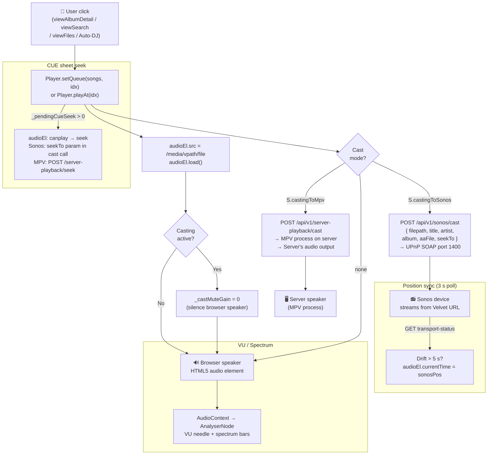
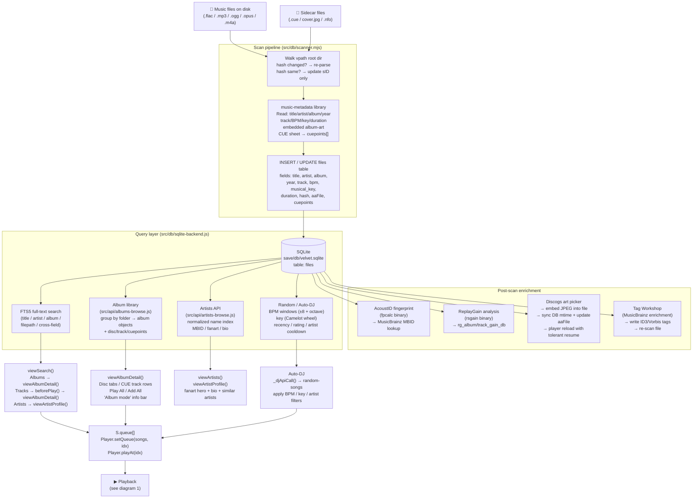
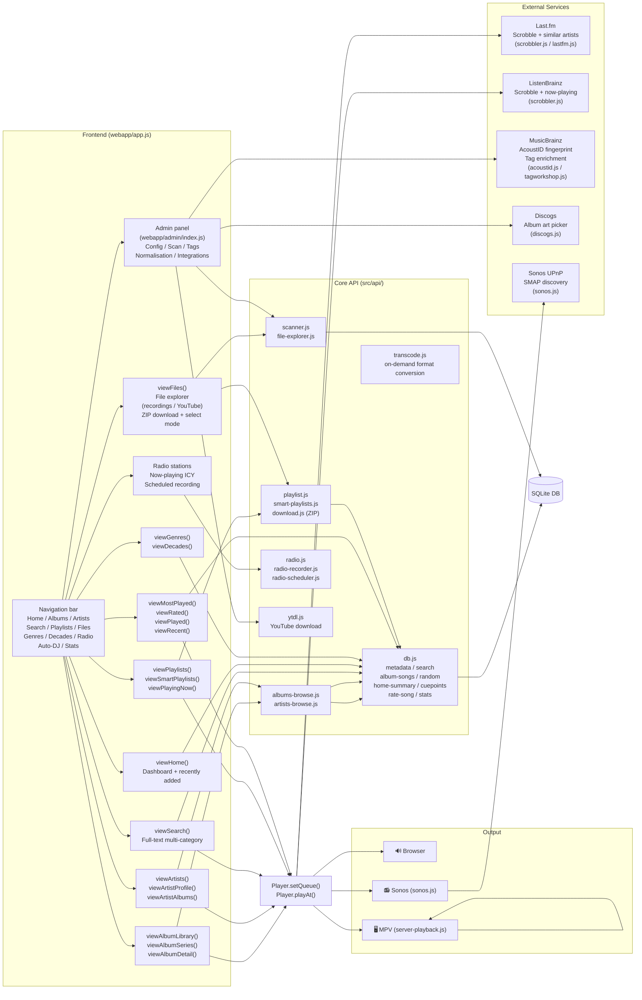
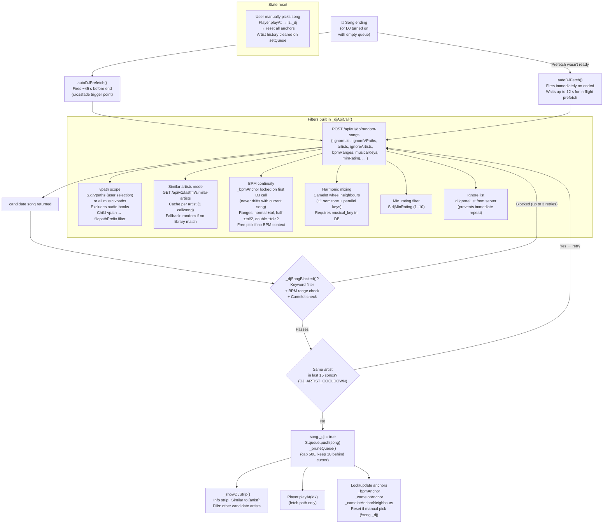
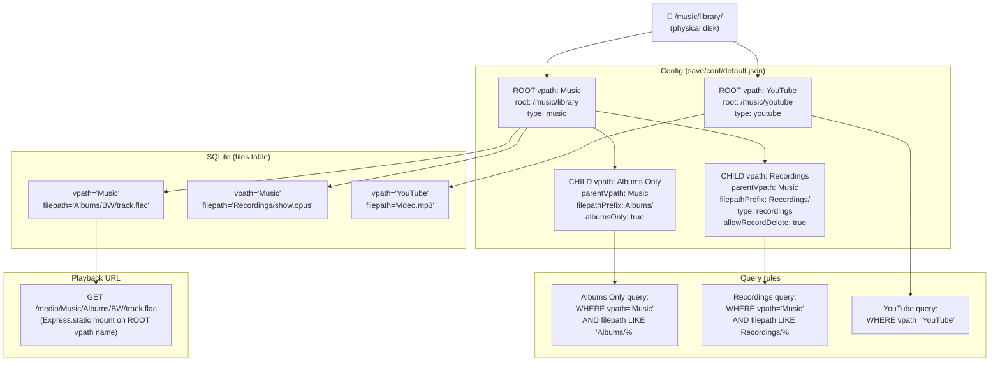
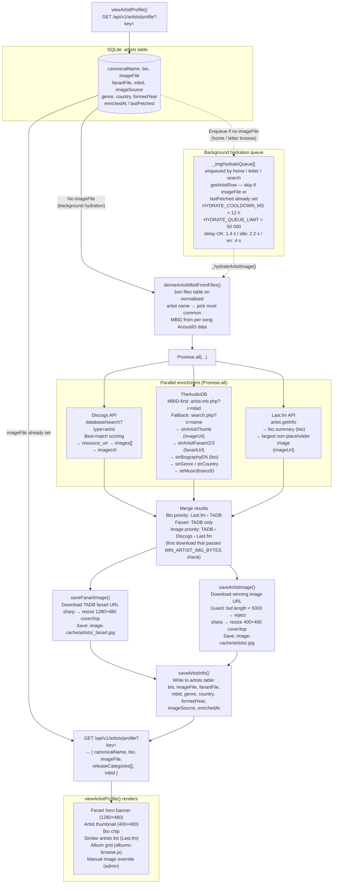

# Velvet — Architecture Diagrams

Paste any diagram block into [mermaid.live](https://mermaid.live) to view / export as SVG or PNG.

---

## 1. Playback Pipeline

How a song gets from storage to speaker — three output paths.

---

## 2. Scan → Index → Play Data Flow

How files go from disk to the queue.

---

## 3. Feature Modules Map

All major subsystems and which API routes / frontend views they connect.

---

## 4. Auto-DJ System

How Auto-DJ selects, filters, and queues the next track.

---

## 5. vpath Hierarchy

How virtual paths are configured and how files are stored vs. queried.

### Media route authorization

- Raw media URLs are now authorized by vpath before static-file serving.
- Requests to unknown or unauthorized libraries return `404` (not `403`) so inaccessible library names are not disclosed.
- Authenticated users can only stream from vpaths in `req.user.vpaths`; no-user mode still allows all configured vpaths.

---

## Diagram 6 — Artist Enrichment Pipeline

How artist metadata and images are fetched from external services and stored.

---

## Diagram 7 — Album Library + CUE Sheet Handling

How albums are built from the database and CUE-sheet tracks are expanded.

```mermaid
flowchart TD
    subgraph "Config: vpath declarations"
        VP1["albumsOnly: true\n(root vpath — all files)"]
        VP2["albumsOnly: true\n(child vpath — filepathPrefix='Albums/')"]
        VP3["fallback: any root with Albums/ subdir on disk"]
    end

    VP1 & VP2 & VP3 --> RESOLVE

    RESOLVE["resolveAlbumsSources()\nReturns source[] each with:\nvpathName, dbVpath, prefix,\nvpathRoot, artRoot\n(cached; invalidated on scan)"]

    RESOLVE --> DBQUERY

    DBQUERY["DB query per source\nWHERE vpath=dbVpath\n[AND filepath LIKE prefix+'%']\nReturns rows: filepath, title, artist,\nalbum, track, disk, year, duration,\naaFile, cover_file, cuepoints"]

    DBQUERY --> BUILDTREE

    subgraph "buildTreeFromDB(rows, source) — BOTTOM-UP"
        direction TB
        BUILDTREE["Strip source.prefix from filepath\nFor each file: look backwards from filename"]
        BUILDTREE --> DISCCHECK
        DISCCHECK{"Immediate parent\n= disc folder?\n(CD1, Disc 2, …)"}
        DISCCHECK -->|"Yes"| DISCALBUM["album = grandparent folder\ndisc = immediate parent\n(any depth — e.g. Genre/Artist/Album/CD1/track)"]
        DISCCHECK -->|"No"| FLATALBUM["album = immediate parent folder\n(any depth — e.g. Genre/Artist/Album/track)"]
        DISCALBUM & FLATALBUM --> ARTIST["artist = one folder above album\n(Genre/Artist → artist='Artist')\nEverything above is display context only"]
        ARTIST --> GROUPALBUM["Group by albumPath\nGroup by artistPath → series\n(multiple albums under same artist folder)"]
        GROUPALBUM --> ALBUM1["Single album under artist\n→ standalone album"]
        GROUPALBUM --> SERIES["Multiple albums under artist\n→ Series + per-album cards\nbuildAlbumFromData() × N"]
    end

    ALBUM1 & ALBUM2 & SERIES --> TRACKLIST

    subgraph "buildTrackListFromEntries()"
        TRACKLIST["Sort by track number → filename\nPer track:\n  filepath = dbVpath + '/' + row.filepath\n  title, artist, number, duration, aaFile\n  cuepoints: JSON.parse(row.cuepoints)\n  (only if length >= 2)"]
    end

    TRACKLIST --> ARTRESOLVE

    subgraph "resolveArt(albums, series)"
        ARTRESOLVE["Series art: first member with aaFile/artFile\n(zero FS calls)\nStandalone albums: parallel fsp.access()\ncheck ART_NAMES (cover.jpg, front.jpg, …)\nDisc sub-folder fallback if no root art"]
    end

    ARTRESOLVE --> CACHE["_cache (slim browse)\n_cacheFull Map<albumId, fullAlbum>\nTTL: 5 min"]

    CACHE --> BROWSE["GET /api/v1/albums/browse\n→ { albums[], series[] }\n(no disc detail — lazy)"]
    CACHE --> DETAIL["GET /api/v1/albums/detail?id=\n→ full album with discs[]\nEach disc has tracks[]\nEach track may have cuepoints[]"]

    DETAIL --> CLIENT["viewAlbumDetail() renders:\nAlbum art header\nDisc tabs (multi-disc)\nTrack rows\n  — if cuepoints ≥ 2: expand\n    each cuepoint as a sub-row\n    with title/timestamp\nPlay All / Add All buttons\n'Album mode' info bar"]

    subgraph "CUE sheet: scan time"
        CUE_SCAN["Scanner reads sidecar .cue or\nembedded CUESHEET vorbis tag\nvia music-metadata\n→ cuepoints[] stored as JSON\nin files.cuepoints column\n(NULL until scanned; [] = probed+empty)"]
    end

    subgraph "CUE sheet: play time"
        CUE_SELECT["Track selected in album view\n→ _cueSeek = cuepoint.timestamp (s)\nSeek bar: tick marks at each cuepoint\n(clickable — seeks + highlights row)"]
        CUE_WEB["🌐 Web browser\naudioEl: canplay event\n→ audioEl.currentTime = _cueSeek"]
        CUE_SONOS["📻 Sonos\nseekTo: Math.floor(_cueSeek)\npassed in POST /api/v1/sonos/cast\n→ UPnP SOAP SetAVTransportURI"]
        CUE_MPV["🖥️ MPV\nPOST /api/v1/server-playback/seek\n{ position: _cueSeek }"]
        CUE_SELECT --> CUE_WEB & CUE_SONOS & CUE_MPV
    end

    CUE_SCAN -.->|"cuepoints[] in DB"| TRACKLIST
    CLIENT -.->|"User selects CUE track"| CUE_SELECT
```

